# 会议纪要管理系统需求分析与业务流程

## 一、需求分析报告

### 1.1 项目概述

#### 1.1.1 项目背景
随着企业会议数量增加，会议纪要的管理成为重要工作。传统的邮件、纸质文档方式存在版本混乱、协作效率低、追溯困难等问题。本系统旨在提供一个高效、协作且可追溯的会议纪要管理平台。

#### 1.1.2 项目目标
- 实现会议纪要全生命周期管理
- 提供用户工作台模式，提升用户体验
- 支持协作编辑与版本控制
- 确保会议信息准确传达与落实

---

### 1.2 功能需求分析

#### 1.2.1 用户管理模块

| 功能点 | 需求描述 | 优先级 |
|--------|----------|--------|
| 用户注册与登录 | 支持用户注册、登录、退出操作 | 高 |
| 个人信息管理 | 用户可修改姓名、邮箱、部门等信息 | 高 |
| 权限管理 | 基于角色的访问控制（普通用户、管理员） | 高 |
| 组织架构管理 | 维护企业组织结构，支持部门层级 | 中 |

#### 1.2.2 用户工作台模块

| 功能点 | 需求描述 | 优先级 |
|--------|----------|--------|
| 待办事项 | 显示指派给当前用户的待修改/待确认纪要任务 | 高 |
| 我发起的 | 展示用户创建的会议纪要列表及状态（草稿、已发送、修订中） | 高 |
| 我参与的 | 展示用户作为与会者或抄送人的纪要列表 | 高 |
| 快捷入口 | 提供新建纪要、模板管理、个人中心的快捷访问 | 中 |

#### 1.2.3 会议纪要创建与编辑模块

| 功能点 | 需求描述 | 优先级 |
|--------|----------|--------|
| 手动录入 | 提供富文本编辑器，支持格式化文本、表格、图片插入 | 高 |
| 实时保存 | 编辑器支持自动草稿保存，防止数据丢失 | 高 |
| 编辑锁定机制 | 当用户正在编辑时，对其他人显示"编辑锁定"状态 | 高 |
| 模板选择 | 新建纪要时支持选择预置模板或自定义模板 | 高 |

#### 1.2.4 会议纪要发送模块

| 功能点 | 需求描述 | 优先级 |
|--------|----------|--------|
| 接收人选择 | 自动读取会议元数据中的与会者列表，支持手动增删 | 高 |
| 邮件发送 | 系统生成包含会议信息的HTML邮件发送给与会者 | 高 |
| 邮件模板 | 支持自定义邮件模板，包含会议主题、时间、地点及纪要核心内容 | 中 |
| 系统链接 | 邮件附带系统链接，支持在线查看纪要 | 高 |
| 发送状态通知 | 邮件发送成功后，通过消息中心通知发起人 | 中 |

#### 1.2.5 版本管理模块

| 功能点 | 需求描述 | 优先级 |
|--------|----------|--------|
| 版本号管理 | 采用主版本号.次版本号格式（如V1.0, V1.1, V2.0） | 高 |
| 历史版本追溯 | 每次正式发布或归档生成新的主版本 | 高 |
| 版本差异对比 | 支持在线对比任意两个版本文档的内容差异，高亮显示新增/删除内容 | 高 |
| 版本回滚 | 发起人或管理员有权将当前文档恢复到任意历史版本 | 高 |
| 版本备注 | 每个版本支持添加修改说明备注 | 中 |

#### 1.2.6 协作指派模块

| 功能点 | 需求描述 | 优先级 |
|--------|----------|--------|
| 指派修订 | 发起人可针对特定段落或全文点击"指派修订" | 高 |
| 被指派人选择 | 从组织架构中选择特定用户 | 高 |
| 修改指令填写 | 输入修改意见或要求 | 高 |
| 工作台通知 | 被指定用户的工作台待办事项中出现该任务 | 高 |
| 修订模式 | 被指定用户编辑时系统开启修订模式或建议模式，记录修改痕迹 | 高 |
| 自动反馈通知 | 修改完成后自动向发令人发送站内信或邮件通知 | 高 |
| 审核与合并 | 发起人可选择合并修改生成新版本或驳回要求重改 | 高 |

#### 1.2.7 模板管理模块

| 功能点 | 需求描述 | 优先级 |
|--------|----------|--------|
| 预置模板 | 系统提供通用模板（决议型、讨论型、周会型） | 中 |
| 自定义模板创建 | 用户可创建个人模板，定义字段 | 中 |
| 模板字段定义 | 支持定义会议背景、决策项、待办人、截止时间等字段 | 中 |
| 另存为模板 | 支持将当前编辑好的文档另存为"我的模板" | 中 |
| 模板共享 | 支持将个人模板共享给团队或部门 | 低 |

#### 1.2.8 消息通知模块

| 功能点 | 需求描述 | 优先级 |
|--------|----------|--------|
| 站内消息 | 支持系统内部消息通知 | 高 |
| 邮件通知 | 支持重要事件的邮件通知 | 高 |
| 消息中心 | 统一的消息管理界面，查看历史消息 | 中 |
| 消息分类 | 按类型分类显示（待办提醒、审核通知、系统公告等） | 中 |

#### 1.2.9 搜索功能模块

| 功能点 | 需求描述 | 优先级 |
|--------|----------|--------|
| 全文搜索 | 支持按关键词搜索会议纪要标题和内容 | 高 |
| 高级搜索 | 支持按日期范围、创建人、部门、状态、纪要类型等多条件组合搜索 | 高 |
| 搜索历史 | 记录用户搜索历史，支持快速访问 | 中 |
| 搜索结果高亮 | 搜索结果中高亮显示匹配关键词 | 中 |
| 搜索导出 | 支持将搜索结果导出为Excel | 低 |

#### 1.2.10 导出功能模块

| 功能点 | 需求描述 | 优先级 |
|--------|----------|--------|
| 导出Word | 支持将纪要导出为Word格式，保留格式 | 高 |
| 导出PDF | 支持将纪要导出为PDF格式，防止修改 | 高 |
| 批量导出 | 支持勾选多个纪要批量导出为ZIP包 | 中 |
| 版本对比导出 | 支持将版本对比结果导出，包含差异标注 | 中 |
| 自定义导出 | 支持选择导出范围（仅正文/含元数据/含附件） | 中 |

#### 1.2.11 附件管理模块

| 功能点 | 需求描述 | 优先级 |
|--------|----------|--------|
| 附件上传 | 支持上传会议相关附件，单个文件最大500MB | 高 |
| 附件下载 | 支持下载纪要中的附件，支持批量下载 | 高 |
| 附件预览 | 支持在线预览常见格式附件（图片、PDF、Office文档） | 高 |
| 附件管理 | 支持附件的增删改查，支持附件版本关联 | 高 |
| 附件搜索 | 支持按文件名、上传时间搜索附件 | 中 |

#### 1.2.12 评论/讨论模块

| 功能点 | 需求描述 | 优先级 |
|--------|----------|--------|
| 纪要评论 | 支持对已发送纪要添加评论，支持@提醒 | 中 |
| 评论回复 | 支持对评论进行回复，形成讨论串 | 中 |
| 评论通知 | 评论后通知发起人和相关人员 | 中 |
| 评论管理 | 支持删除不当评论，仅发起人和管理员可删除 | 低 |
| 评论搜索 | 支持搜索历史评论 | 低 |

#### 1.2.13 统计分析模块

| 功能点 | 需求描述 | 优先级 |
|--------|----------|--------|
| 使用统计 | 统计纪要创建数量、发送数量、归档数量、按时间趋势分析 | 中 |
| 用户活跃度 | 统计用户登录次数、操作频率、参与度 | 中 |
| 部门分析 | 按部门统计纪要数量、平均完成时间、活跃度排名 | 中 |
| 任务效率 | 统计指派任务完成率、平均完成时间、延期率 | 中 |
| 导出报表 | 支持导出统计报表为Excel、PDF | 低 |
| 图表展示 | 支持以柱状图、折线图、饼图展示统计数据 | 低 |

---

### 1.3 非功能需求分析

#### 1.3.1 性能需求

| 指标 | 要求 |
|------|------|
| 系统响应时间 | 页面加载时间 < 3秒，操作响应时间 < 1秒 |
| 并发用户数 | 支持1000+用户同时在线操作 |
| 搜索性能 | 全文搜索响应时间 < 2秒 |
| 文档处理能力 | 支持单个文档大小不超过50MB |
| 数据库查询 | 常用查询响应时间 < 500ms |
| 文件上传 | 支持单文件上传速度 > 5MB/s |
| 版本对比 | 版本差异对比响应时间 < 3秒 |
| 系统负载 | 支持10万+纪要文档存储 |
| 数据库连接池 | 支持100+并发数据库连接 |
| 缓存命中率 | Redis缓存命中率 > 80% |

#### 1.3.2 安全需求

| 指标 | 要求 |
|------|------|
| 身份认证 | 支持用户名密码登录，密码加密存储 |
| 密码策略 | 密码至少8位，包含大小写字母、数字、特殊字符，90天强制修改 |
| 密码存储 | 使用BCrypt或Argon2加密算法 |
| 防SQL注入 | 使用参数化查询，ORM框架，禁止字符串拼接SQL |
| 防XSS攻击 | 对用户输入进行转义和过滤，使用Content Security Policy |
| 防CSRF攻击 | 使用CSRF Token，验证Referer |
| 权限控制 | 基于角色的访问控制，确保数据隔离 |
| 会话管理 | 会话超时时间30分钟，支持单点登录，异地登录检测 |
| 敏感数据加密 | 邮箱、手机号等敏感信息AES加密存储 |
| 数据传输 | 使用HTTPS协议加密传输 |
| 审计日志 | 记录所有用户操作，包括登录、修改、删除、导出等 |
| API安全 | 使用HTTPS，API限流，签名验证 |
| 数据备份 | 每日自动备份，保留30天历史备份 |

#### 1.3.3 可用性需求

| 指标 | 要求 |
|------|------|
| 系统可用性 | 99.5%以上可用时间 |
| 故障恢复 | 系统故障后1小时内恢复服务 |
| 数据完整性 | 确保数据不丢失，支持事务回滚 |
| 容错能力 | 关键操作失败后提供友好提示和恢复选项 |
| 数据恢复 | 支持从备份中恢复数据，恢复时间 < 2小时 |
| 灾难恢复 | 建立异地备份，RTO（恢复时间目标）< 4小时，RPO（恢复点目标）< 1小时 |
| 备份验证 | 定期验证备份可用性，每月进行一次恢复演练 |
| 增量备份 | 每日增量备份，每周全量备份 |
| 备份加密 | 备份文件加密存储，防止数据泄露 |

#### 1.3.4 易用性需求

| 指标 | 要求 |
|------|------|
| 界面友好 | 界面简洁直观，操作流程清晰 |
| 学习成本 | 新用户15分钟内掌握基本操作 |
| 帮助文档 | 提供完整的在线帮助文档和操作指南 |
| 多端适配 | 支持PC端浏览器访问，响应式布局 |
| 操作步骤 | 核心操作不超过5个步骤，每步都有明确的下一步提示 |
| 快捷键支持 | 支持常用操作的快捷键（Ctrl+S保存、Ctrl+N新建等） |
| 无障碍支持 | 支持屏幕阅读器，符合WCAG 2.0标准，支持键盘导航 |
| 多语言支持 | 支持中文、英文等多语言界面切换 |
| 操作指引 | 关键操作提供操作指引和帮助提示 |

#### 1.3.5 可维护性需求

| 指标 | 要求 |
|------|------|
| 代码规范 | 遵循编码规范，代码注释完整 |
| 模块化设计 | 采用模块化架构，便于功能扩展 |
| 日志管理 | 完善的日志记录和监控机制 |
| 版本控制 | 使用Git进行版本管理，支持分支开发 |

#### 1.3.6 兼容性需求

| 指标 | 要求 |
|------|------|
| 浏览器兼容 | 支持Chrome、Firefox、Safari、Edge等主流浏览器 |
| 操作系统 | 支持Windows、macOS、Linux系统 |
| 数据库兼容 | 支持MySQL 5.7+版本 |
| 移动端支持 | 响应式设计，支持移动端浏览器访问 |
| 移动端App | 支持iOS和Android原生App |
| App功能 | 移动端支持查看、评论、通知、快速回复等核心功能 |
| 离线支持 | 支持离线查看已下载的纪要 |
| 推送通知 | 支持App推送通知（APNs、FCM） |
| App版本兼容 | 支持iOS 12+，Android 8.0+ |

---

### 1.4 数据需求分析

#### 1.4.1 核心实体关系

```
部门表 (Departments)
  └─ 用户表 (Users) [1:N]

用户表 (Users)
  ├─ 会议纪要主表 (MeetingMinutes) [1:N]
  ├─ 任务指派表 (TaskAssignments) [1:N]
  ├─ 模板表 (Templates) [1:N]
  ├─ 消息表 (Messages) [1:N]
  ├─ 与会者关联表 (MeetingAttendees) [1:N]
  ├─ 操作日志表 (OperationLogs) [1:N]
  ├─ 附件表 (MinuteAttachments) [1:N]
  └─ 评论表 (MinuteComments) [1:N]

会议纪要主表 (MeetingMinutes)
  ├─ 纪要版本表 (MinuteVersions) [1:N]
  ├─ 任务指派表 (TaskAssignments) [1:N]
  ├─ 与会者关联表 (MeetingAttendees) [1:N]
  ├─ 附件表 (MinuteAttachments) [1:N]
  └─ 评论表 (MinuteComments) [1:N]

纪要版本表 (MinuteVersions)
  ├─ 任务指派表 (TaskAssignments) [1:N]
  └─ 附件表 (MinuteAttachments) [1:N]
```

#### 1.4.2 数据字典

**用户表 (Users)**
- 用户ID (PK): 唯一标识符
- 姓名: 用户真实姓名
- 邮箱: 登录邮箱，唯一
- 密码: 加密存储的密码
- 手机号: 手机号（用于短信通知）
- 角色: 用户角色（普通用户/管理员/部门管理员）
- 部门ID (FK): 所属部门
- 最后修改密码时间: 最后修改密码的时间
- 状态: 账号状态（正常/锁定/禁用）
- 创建时间: 注册时间
- 最后登录时间: 最近登录时间

**会议纪要主表 (MeetingMinutes)**
- 纪要ID (PK): 唯一标识符
- 标题: 会议纪要标题
- 当前版本号: 最新版本号
- 创建人ID (FK): 创建者用户ID
- 状态: 文档状态（草稿/已发送/修订中/已归档）
- 会议日期: 会议召开日期
- 会议时间: 会议召开时间
- 会议地点: 会议地点
- 主持人ID (FK): 会议主持人
- 与会者列表: 与会者信息（JSON格式）
- 抄送人列表: 抄送人信息（JSON格式）
- 元数据来源: 数据来源标识（手动/钉钉/企业微信/日历/邮件）
- 外部会议ID: 外部会议系统关联ID
- 创建时间: 创建时间
- 更新时间: 最后更新时间

**纪要版本表 (MinuteVersions)**
- 版本ID (PK): 唯一标识符
- 纪要ID (FK): 关联的纪要ID
- 版本号: 版本号（如V1.0）
- 内容快照: 文档内容（JSON/HTML格式）
- 修改人ID (FK): 修改者用户ID
- 修改时间: 修改时间
- 备注: 版本修改说明

**任务指派表 (TaskAssignments)**
- 任务ID (PK): 唯一标识符
- 纪要ID (FK): 关联的纪要ID
- 版本ID (FK): 关联的版本ID
- 发令人ID (FK): 发起指派的用户ID
- 被指派人ID (FK): 被指派的用户ID
- 指令内容: 修改要求说明
- 状态: 任务状态（待处理/处理中/已完成/已驳回）
- 创建时间: 指派时间
- 完成时间: 完成时间

**模板表 (Templates)**
- 模板ID (PK): 唯一标识符
- 用户ID (FK): 创建者用户ID
- 模板名称: 模板名称
- 结构定义: 模板结构（JSON格式）
- 类型: 模板类型（预置/自定义）
- 创建时间: 创建时间
- 更新时间: 最后更新时间

**与会者关联表 (MeetingAttendees)**
- 与会者ID (PK): 唯一标识符
- 纪要ID (FK): 关联的纪要ID
- 用户ID (FK): 与会者用户ID
- 角色: 角色（与会者/抄送人/主持人）
- 确认状态: 确认状态（未确认/已确认/拒绝参加）
- 创建时间: 创建时间

**消息表 (Messages)**
- 消息ID (PK): 唯一标识符
- 接收人ID (FK): 接收人用户ID
- 发送人ID (FK): 发送人用户ID（系统消息可为空）
- 消息类型: 消息类型（待办提醒/审核通知/系统公告）
- 优先级: 优先级（紧急/高/中/低）
- 标题: 消息标题
- 内容: 消息内容
- 关联类型: 关联类型（纪要/任务/模板）
- 关联ID: 关联ID
- 是否已读: 已读状态
- 创建时间: 创建时间
- 阅读时间: 阅读时间

**部门表 (Departments)**
- 部门ID (PK): 唯一标识符
- 部门名称: 部门名称
- 父部门ID (FK): 父部门ID（支持部门层级）
- 部门描述: 部门描述
- 排序: 排序号
- 创建时间: 创建时间

**操作日志表 (OperationLogs)**
- 日志ID (PK): 唯一标识符
- 用户ID (FK): 操作用户ID
- 操作类型: 操作类型（登录/修改/删除/导出等）
- 操作详情: 操作详情
- IP地址: IP地址
- 用户代理: 用户代理（浏览器信息）
- 创建时间: 创建时间

**附件表 (MinuteAttachments)**
- 附件ID (PK): 唯一标识符
- 纪要ID (FK): 关联的纪要ID
- 版本ID (FK): 关联的版本ID（可为空表示属于整个纪要）
- 文件名称: 文件名称
- 文件路径: 文件存储路径
- 文件大小: 文件大小（字节）
- 文件类型: 文件MIME类型
- 上传人ID (FK): 上传者用户ID
- 创建时间: 创建时间

**评论表 (MinuteComments)**
- 评论ID (PK): 唯一标识符
- 纪要ID (FK): 关联的纪要ID
- 用户ID (FK): 评论者用户ID
- 父评论ID (FK): 父评论ID（支持评论回复）
- 评论内容: 评论内容
- @提及: @提及的用户列表（JSON格式）
- 创建时间: 创建时间
- 更新时间: 更新时间
- 是否删除: 删除状态

---

### 1.5 系统约束分析

#### 1.5.1 技术约束
- 前端技术栈: Vue3 + Element Plus
- 后端技术栈: Spring Boot + MyBatis
- 数据库: MySQL 8.0+（关系型数据）
- 富文本编辑器: TinyMCE
- 邮件服务: SMTP协议
- 文件存储: 项目磁盘存储
- 文档导出: Apache POI + iText（Word/PDF导出）
- 图表库: ECharts（统计图表展示）
- 安全认证: Spring Security + JWT（身份认证和权限控制）
- 邮件发送: Spring Mail（邮件通知）
- 日志框架: SLF4J + Logback（审计日志）

#### 1.5.2 业务约束
- 版本号规则必须遵循主版本号.次版本号格式
- 发起人具有最高权限，可进行版本回滚和审核
- 编辑锁定机制确保同一时间只有一个用户可编辑
- 邮件发送必须包含完整的会议信息
- 指派任务必须明确修改指令和要求

#### 1.5.3 时间约束
- 自动草稿保存间隔不超过30秒
- 邮件发送延迟不超过5分钟
- 版本合并操作响应时间不超过3秒
- 历史版本查询响应时间不超过2秒

---

## 二、系统业务流程设计

### 2.1 核心业务流程

#### 2.1.1 会议纪要创建流程

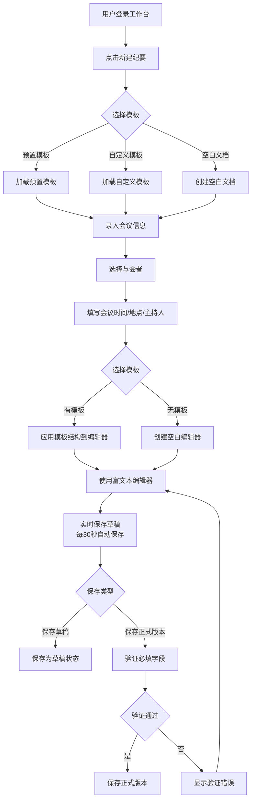

#### 2.1.2 会议纪要发布流程

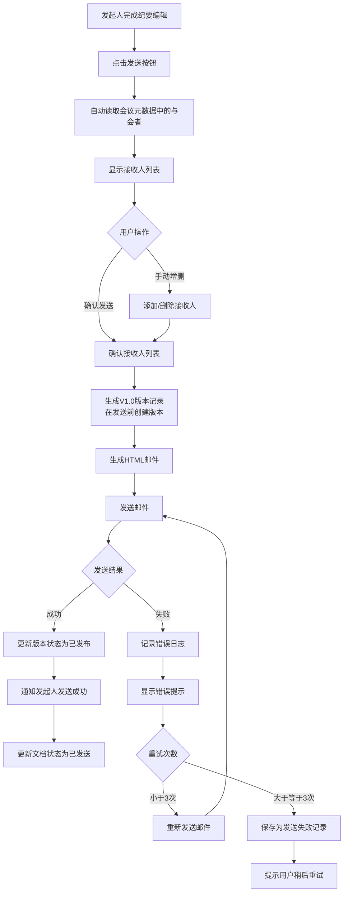

#### 2.1.3 协作指派流程

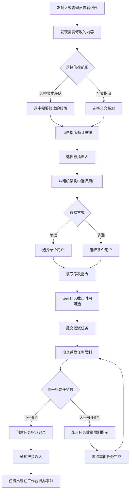

#### 2.1.4 修订处理流程

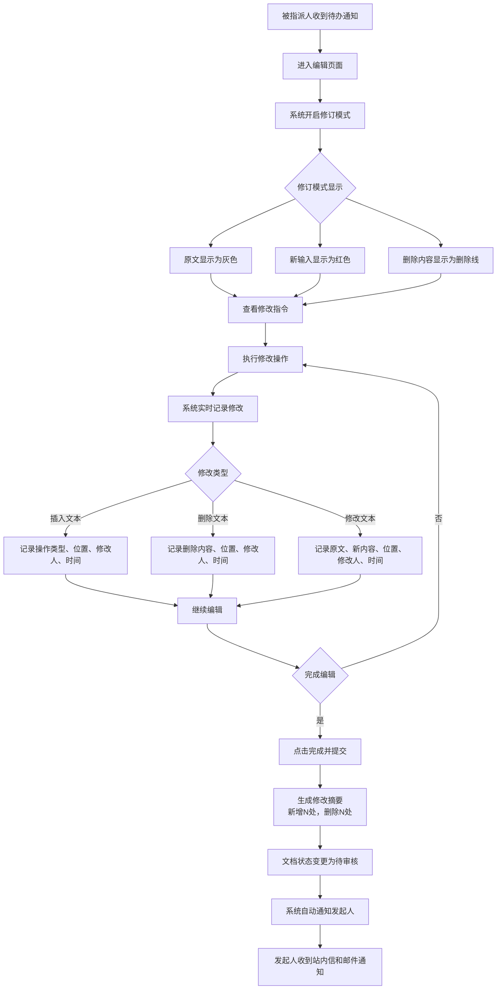

#### 2.1.5 审核与合并流程

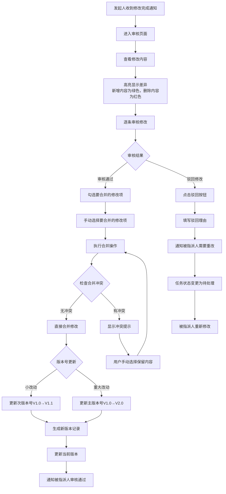

#### 2.1.6 版本管理流程

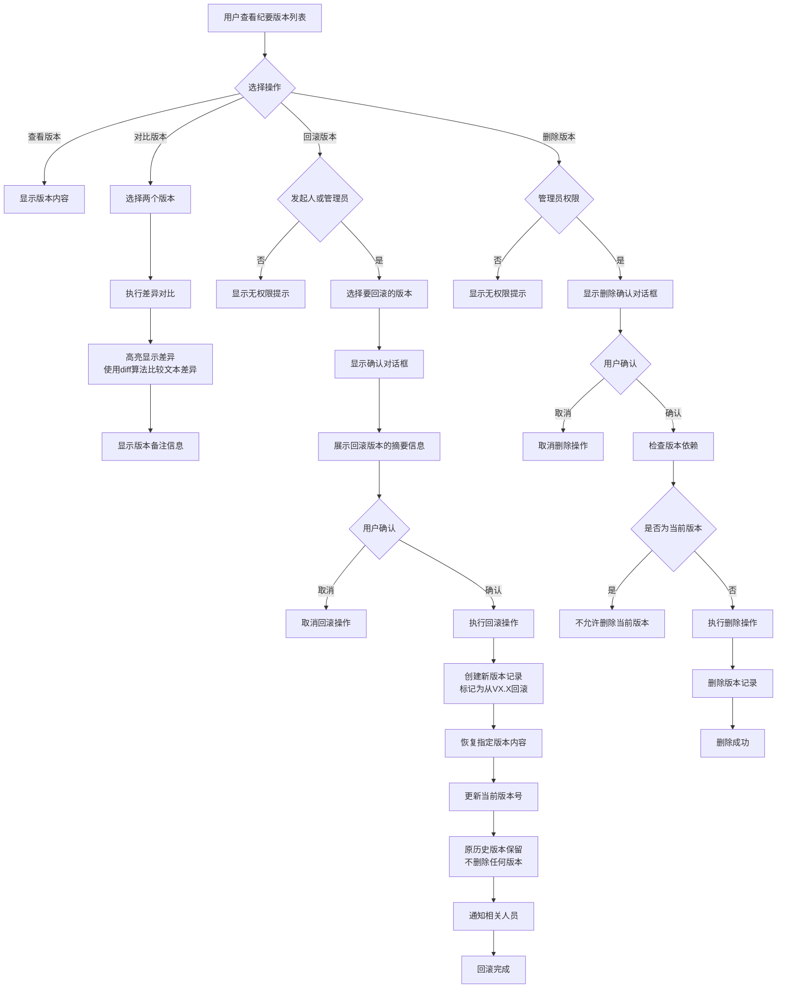

#### 2.1.7 模板管理流程

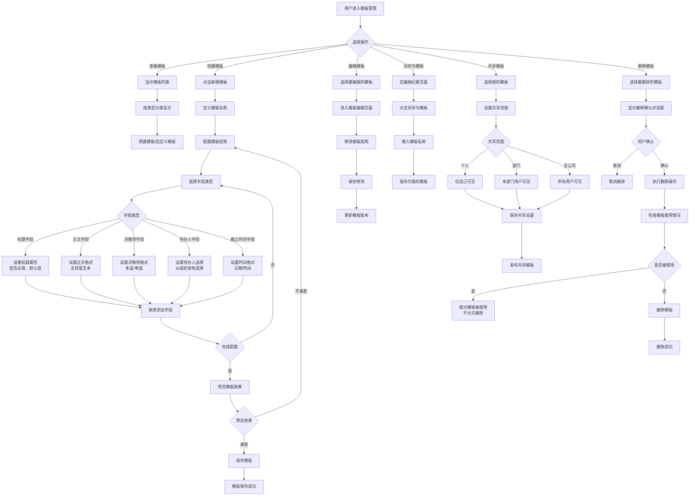

---

### 2.2 完整业务流程

#### 2.2.1 会议纪要全生命周期流程

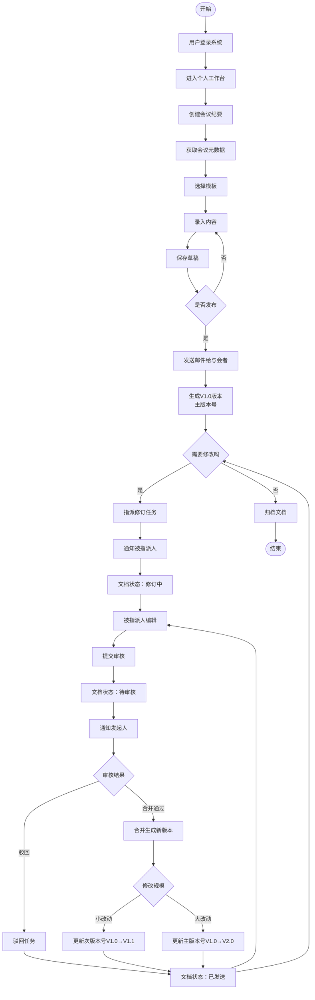

#### 2.2.2 用户工作台主流程

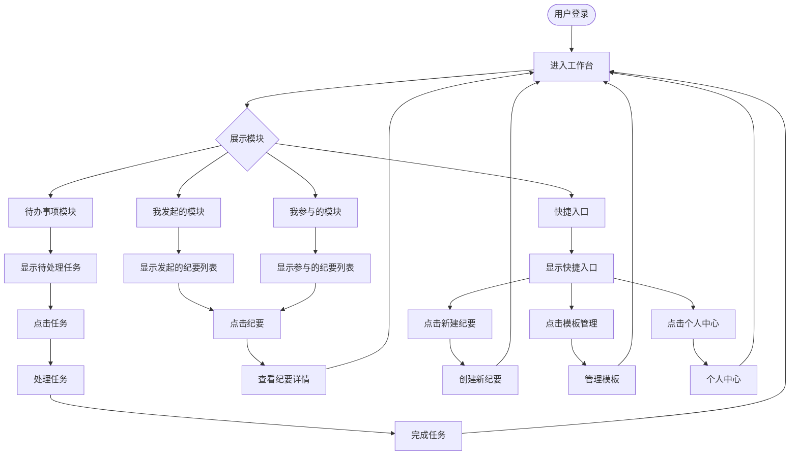

---

### 2.3 补充业务流程

#### 2.3.1 会议元数据获取流程

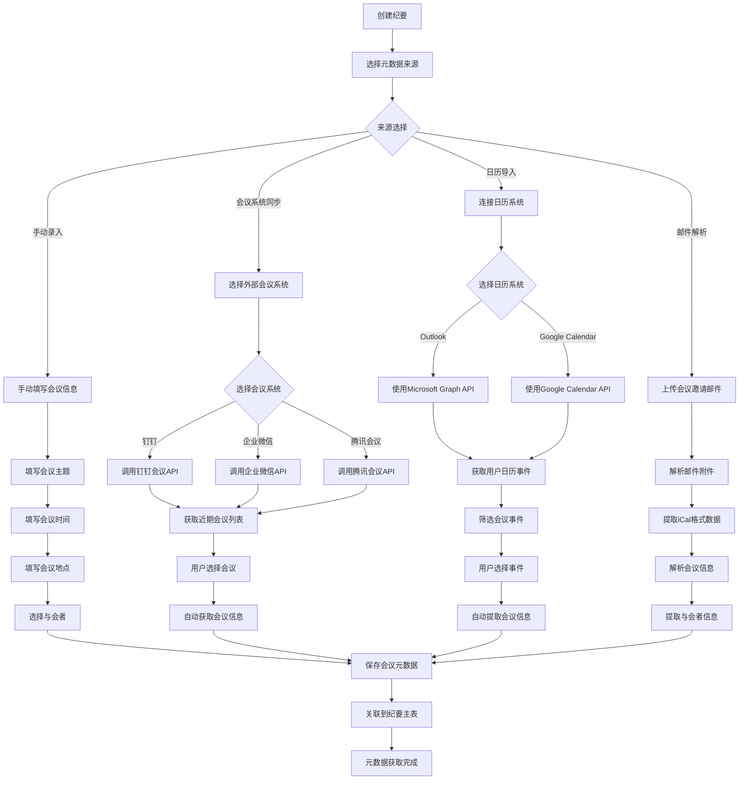

#### 2.3.2 编辑锁定超时处理流程

```mermaid
graph TD
    A[用户开始编辑文档] --> B{检查编辑状态}
    B -->|文档未锁定| C[允许编辑]
    B -->|文档已被锁定| D[显示锁定提示]
    D --> E[显示编辑者信息]
    E --> F[提供刷新选项]
    F --> G{用户选择}
    G -->|刷新| B
    G -->|等待| H[等待其他用户完成]
    H --> B
    C --> I[设置编辑锁定]
    I --> J[设置锁定超时时间<br/>30分钟]
    J --> K[开始编辑]
    K --> L{检测用户操作}
    L -->|有操作| M[重置超时计时器]
    M --> L
    L -->|超时未操作| N[自动释放锁定]
    N --> O[保存当前草稿]
    O --> P[通知用户编辑超时]
    P --> Q[标记为未编辑状态]
    Q --> R{用户响应}
    R -->|继续编辑| S[重新申请编辑锁定]
    S --> I
    R -->|放弃编辑| T[返回工作台]
    K --> U{完成编辑}
    U -->|是| V[释放编辑锁定]
    V --> W[保存文档]
    W --> X[编辑完成]
  ```

#### 2.3.3 消息通知触发与处理流程

```mermaid
graph TD
    A[业务操作触发] --> B[判断通知类型]
    B --> C{通知优先级}
    C -->|紧急通知| D[站内信 + 邮件 + 短信]
    C -->|普通通知| E[站内信 + 邮件]
    C -->|抄送通知| F[仅站内信]
    D --> G[生成通知消息]
    E --> G
    F --> G
    G --> H[设置通知属性]
    H --> I[设置消息类型<br/>待办提醒/审核通知/系统公告]
    I --> J[设置优先级<br/>紧急/高/中/低]
    J --> K[设置接收人]
    K --> L[存储到消息表]
    L --> M[发送站内信]
    M --> N{发送邮件}
    N -->|需要| O[发送邮件通知]
    N -->|不需要| P[邮件发送完成]
    O --> P
    P --> Q{发送短信}
    Q -->|需要| R[发送短信通知]
    Q -->|不需要| S[短信发送完成]
    R --> S
    S --> T[通知发送完成]
    T --> U[用户登录系统]
    U --> V[检查未读消息]
    V --> W[显示消息中心]
    W --> X{消息分类}
    X -->|待办提醒| Y[显示待办事项]
    X -->|审核通知| Z[显示审核通知]
    X -->|系统公告| AA[显示系统公告]
    Y --> AB[用户查看消息]
    Z --> AB
    AA --> AB
    AB --> AC[更新消息状态为已读]
    AC --> AD[记录查看时间]
    AD --> AE{消息状态}
    AE -->|已处理| AF[归档消息]
    AE -->|未处理| AG[保持未读状态]
    AF --> AH[消息进入历史记录]
    AH --> AI{消息过期}
    AI -->|是| AJ[删除过期消息]
    AI -->|否| AK[保留消息]
    AJ --> AL[清理完成]

#### 2.3.4 编辑冲突处理流程

```mermaid
graph TD
    A[用户尝试编辑文档] --> B{检查编辑状态}
    B -->|文档未锁定| C[允许编辑]
    B -->|文档已被锁定| D[显示锁定提示]
    D --> E[显示编辑者信息]
    E --> F[提供刷新选项]
    F --> G[用户选择操作]
    G -->|刷新| B
    G -->|等待| H[等待其他用户完成]
    H --> B
    C --> I[设置编辑锁定]
    I --> J[开始编辑]
    J --> K[完成编辑]
    K --> L[释放编辑锁定]
```

#### 2.3.2 邮件发送失败处理流程

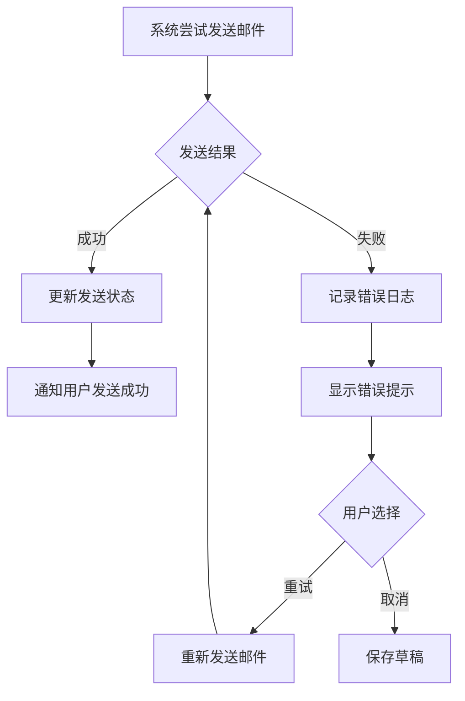

#### 2.3.3 版本回滚确认流程

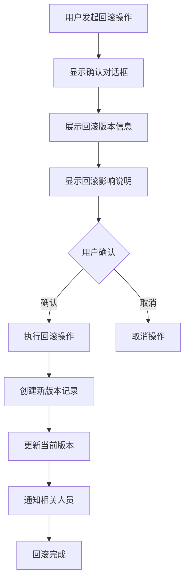

---

### 2.4 数据流转图

#### 2.4.1 会议纪要数据流转

```
用户输入 → 富文本编辑器 → 实时保存草稿 → 数据库存储
    ↓
完成编辑 → 生成版本记录 → 发送邮件通知与会者
    ↓
指派修改 → 创建任务记录 → 被指派人修改 → 提交审核
    ↓
审核通过 → 合并修改 → 生成新版本 → 更新数据库
    ↓
版本归档 → 最终版本存储 → 历史记录保存
```

#### 2.4.2 消息通知数据流转

```
业务操作触发 → 生成通知消息 → 存储到消息表
    ↓
用户登录 → 检查未读消息 → 显示消息中心
    ↓
用户查看消息 → 更新消息状态 → 记录查看时间
    ↓
消息过期 → 归档历史消息 → 清理过期数据
```

---

### 2.5 系统状态转换图

#### 2.5.1 会议纪要状态转换

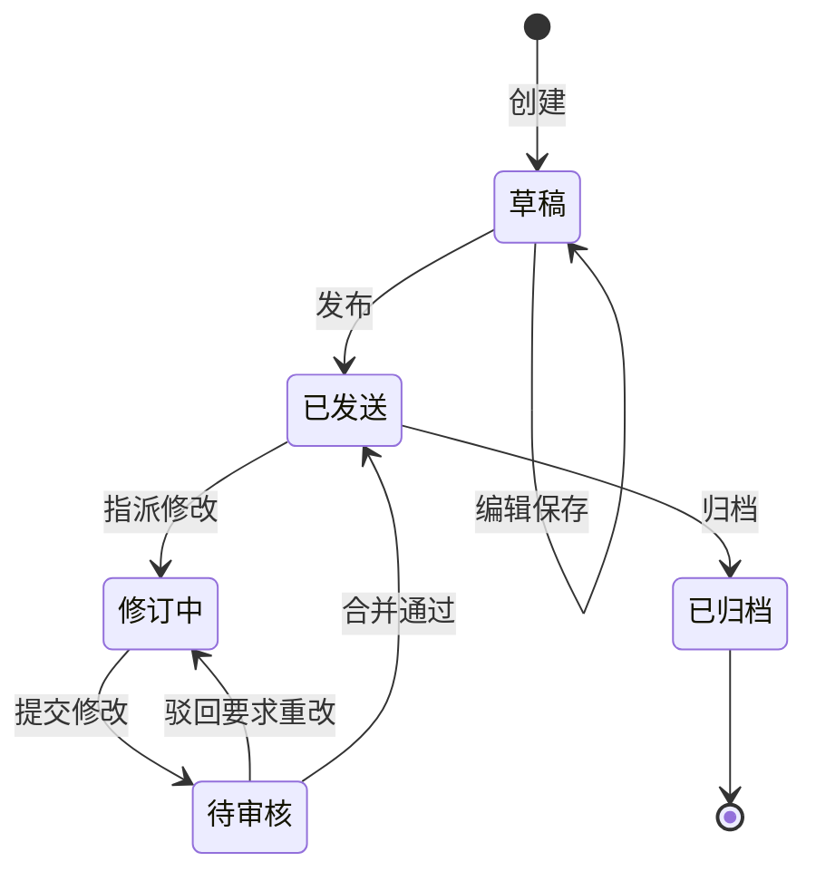

#### 2.5.2 任务指派状态转换

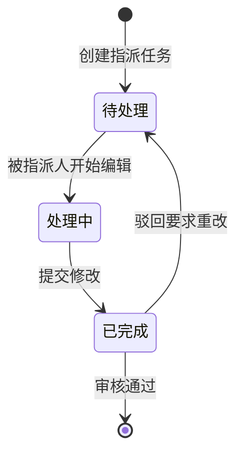

---

## 三、总结

本需求分析报告详细描述了会议纪要管理系统的功能需求、非功能需求、数据需求和系统约束。系统业务流程设计涵盖了核心业务流程、完整业务流程、异常处理流程、数据流转和状态转换，为系统开发和实施提供了清晰的指导。

系统的核心价值在于：
1. 提供高效的用户工作台，提升用户体验
2. 实现完整的协作流程，支持多人协作编辑
3. 强大的版本管理能力，确保历史可追溯
4. 灵活的模板系统，满足不同类型会议需求
5. 完善的消息通知机制，确保信息及时传达

通过本系统的实施，将有效提升企业会议纪要管理的效率和准确性。
